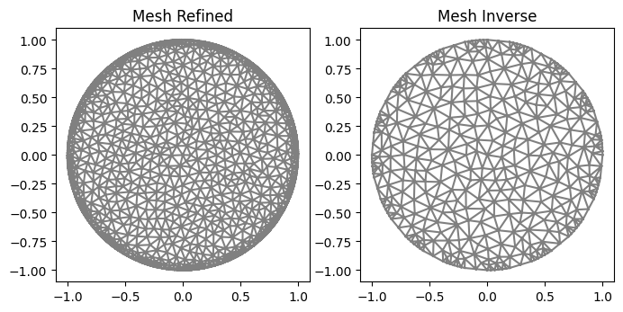
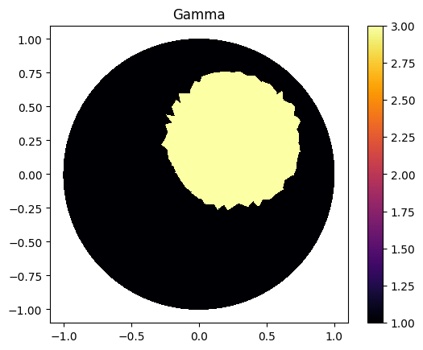
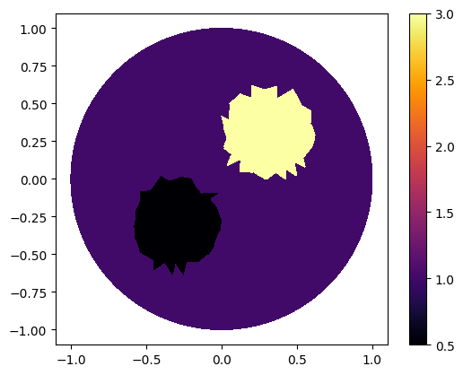
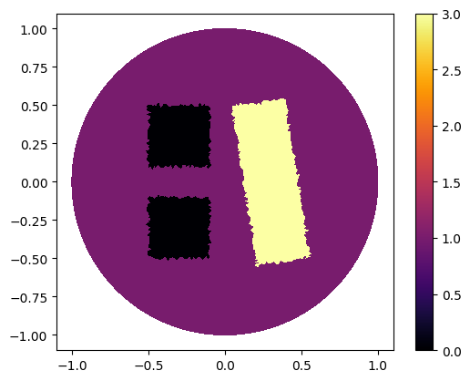
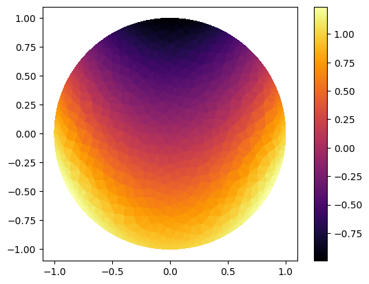
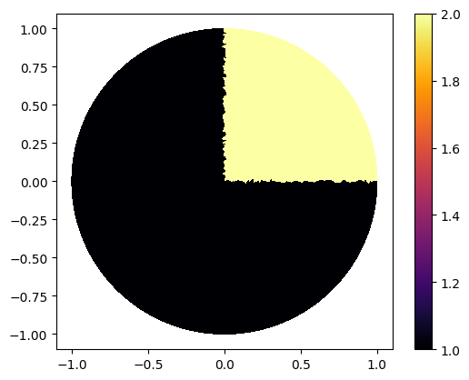

.. tutorial

Creating Functions
=========================================

This demo is implemented in a single Python file. :download:`tutorial_createfunc.ipynb`

This demo illustrates how to:

* How to use :func:`GammaCircle`.
* Defines its function based on the cells.
* How to use Expression and Conditional Expression.

::

    from module1_mesh import*
    from module2_forward import*
    from module3_inverse import*
    from module4_auxiliar import*
    import matplotlib.pyplot as plt
    %matplotlib inline

**********************
Defining Mesh
**********************

::

    "Mesh"
    ele_pos=electrodes_position(L=16, per_cober=0.5, rotate=0) 
    mesh_inverse=MyMesh(r=1, n=10, n_in=7, n_out=0, electrodes_obj=ele_pos)
    mesh_refined=MyMesh(r=1, n=15, n_in=25, n_out=10, electrodes_obj=ele_pos)

    "Plot"
    plt.figure(figsize=(8, 8))
    plt.subplot(1,2,1)
    plot(mesh_refined, title="Mesh Refined");
    plt.subplot(1,2,2)
    plot(mesh_inverse, title="Mesh Inverse");

GammaCircle and plot_figure
****************************************

::

    ValuesCells0=GammaCircle(mesh_refined,3.0,1.0,0.50, 0.25, 0.25);
    Q = FunctionSpace(mesh_refined, "DG", 0) #Define Function space with basis Descontinuous Galerkin
    gamma = Function(Q)
    gamma.vector()[:]=ValuesCells0          

    "Plot"
    p=plot(gamma, title="")
    plot(mesh_refined)
    plt.colorbar(p)    

Combining Two Circles
****************************************

::

    ValuesCells0=GammaCircle(mesh_refined,2.5,0.5,0.30, 0.30, 0.30);
    ValuesCells1=GammaCircle(mesh_refined,0.0,0.5,0.30, -0.30, -0.30);
    gamma.vector()[:]=ValuesCells0+ValuesCells1          

    plot_figure(gamma, name="", map="inferno");

Refining the Mesh for Best Results
****************************************

::

    mesh_refined2=MyMesh(r=1, n=50, n_in=25, n_out=10, electrodes_obj=ele_pos)

    ValuesCells0=GammaCircle(mesh_refined2,2.5,0.5,0.30, 0.30, 0.30);
    ValuesCells1=GammaCircle(mesh_refined2,0.0,0.5,0.30, -0.30, -0.30);
    Q2 = FunctionSpace(mesh_refined2, "DG", 0)
    gamma2 = Function(Q2)
    gamma2.vector()[:]=ValuesCells0+ValuesCells1

    plot_figure(gamma2, name="", map="inferno");

.. image:: createfunc/gamma2.png
   :scale: 75 %

GammaRec
****************************************

::

    def GammaRec(mesh, in_v, out_v, radius,centerx, centery, angle=0, a=1, b=1):
        ValuesGamma=np.zeros(mesh.num_cells())
        centerx_new = centerx*cos(angle)-centery*sin(angle)
        centery_new = centery*cos(angle)+centerx*sin(angle)
        centerx, centery=centerx_new, centery_new
        
        for i in range(0, mesh.num_cells()):
            cell = Cell(mesh, i)
            
            vertices=np.array(cell.get_vertex_coordinates())
            x=(vertices[0]+vertices[2]+vertices[4])/3           
            y=(vertices[1]+vertices[3]+vertices[5])/3
            
            "rotation"
            x_new=x*cos(angle)-y*sin(angle)
            y_new=y*cos(angle)+x*sin(angle)
            x,y=x_new,y_new
            

            
            if (1/a*abs(x-centerx)>=radius) or 1/b*abs(y-centery)>=radius:
                ValuesGamma[i]=out_v
            else:
                ValuesGamma[i]=in_v
        
        return ValuesGamma

    ValuesCells1=GammaRec(mesh_refined2, 3.0, 1.0, 0.35, 0.3, 0.0, pi/2*0.9, 1.5, 0.5);
    ValuesCells2=GammaRec(mesh_refined2,-1.0, 0.0, 0.2, -0.30, -0.30);
    ValuesCells3=GammaRec(mesh_refined2,-1.0, 0.0, 0.2, -0.30, 0.30);
    gamma2.vector()[:]=ValuesCells1+ValuesCells2+ValuesCells3      

    plot_figure(gamma2, name="", map="inferno");

   
   
Creating Functions Using Expression
****************************************

::

    def evalinElement(mesh, u, cell_number):
        cell = Cell(mesh, cell_number)
        vertices=np.array(cell.get_vertex_coordinates())
        x=(vertices[0]+vertices[2]+vertices[4])/3           
        y=(vertices[1]+vertices[3]+vertices[5])/3
    
        result=u(x,y)   
        return result

    func=Expression("pow(x[0],2)-x[1]", degree=2)

    mesh=mesh_refined
    ValuesCells4=np.zeros(mesh.num_cells())
    for cell_index in range(mesh.num_cells()):
        ValuesCells4[cell_index]=evalinElement(mesh, func, cell_index)
        
    gamma.vector()[:]=ValuesCells4          

    plot_figure(gamma, name="", map="inferno");

Conditional Expression
****************************************

::

    func2=Expression("x[1]>= 0 & x[0]>=0 ? 2 : 1 ", degree=2)

    mesh=mesh_refined2
    ValuesCells5=np.zeros(mesh.num_cells())
    for cell_index in range(mesh.num_cells()):
        ValuesCells5[cell_index]=evalinElement(mesh, func2, cell_index)
        
    gamma2.vector()[:]=ValuesCells5
    plot_figure(gamma2, name="", map="inferno");

