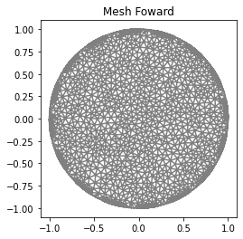
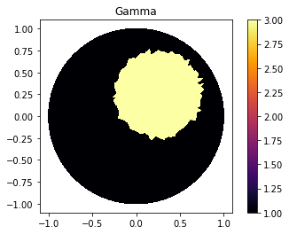
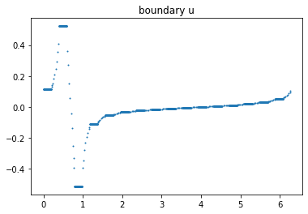
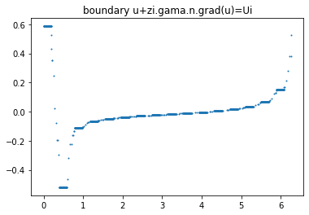
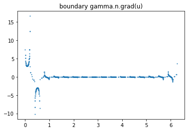
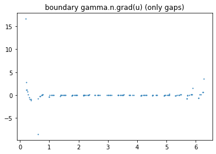
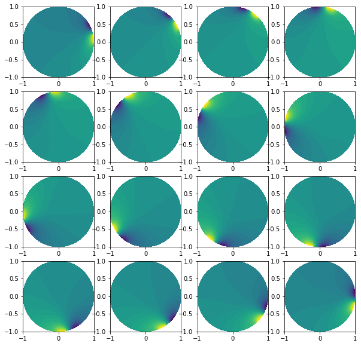
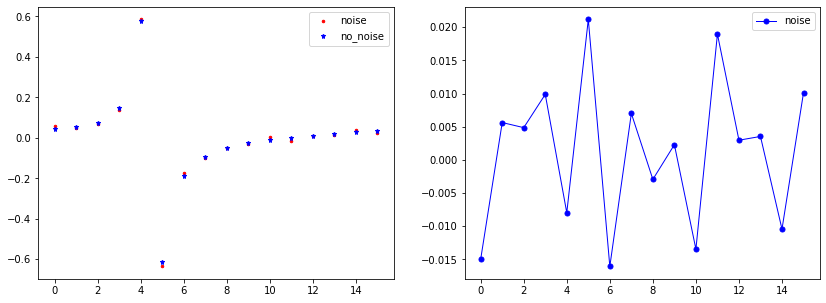

.. tutorial

Forward Problem
=========================================

This demo is implemented in a single Python file. Download here: :download:`tutorial_forward.ipynb`

This demo illustrates how to:

* How to use :class:`ForwardProblem`.::

    from module1_mesh import*
    from module2_forward import*
    from module3_inverse import*
    from module4_auxiliar import*
    import matplotlib.pyplot as plt
    %matplotlib inline

Mesh
**********************

::

    "Electrodes and Mesh"
    ele_pos=electrodes_position(L=16, per_cober=0.5, rotate=0)
    mesh_refined=MyMesh(r=1, n=10*2, n_in=8*10, n_out=3*2, electrodes_obj=ele_pos)
    

Defining Gamma function
****************************************

::

    ValuesCells0=GammaCircle(mesh_refined,3.0,1.0,0.50, 0.25, 0.25);
    Q = FunctionSpace(mesh_refined, "DG", 0) #Define Function space with basis Descontinuous Galerkin
    gamma0 = Function(Q)
    gamma0.vector()[:]=ValuesCells0          

    "Plot"
    plot_figure(gamma0, name="")

Forward Problem
****************************************

::

    "Forward Problem"
    L=16
    VD=FiniteElement('CG',mesh_refined.ufl_cell(),1) #Lagrange pol. degree 1
    l=int(L)                                        #Measurements number.
    z=np.ones(L)*0.025E-5                           #Impedance
    I_all=current_method(L,l, method=2, value=1)    #Current pattern

    ForwardObject=ForwardProblem(mesh_refined, z)

    VD=FiniteElement('CG',mesh_refined.ufl_cell(),1) #Solution Space Continous Galerkin
    list_u0,list_U0 = ForwardObject.solve_forward(VD, I_all, gamma0)
    list_U0 = (np.array(list_U0).flatten())

Checking Results
****************************************

Boundary plot
----------------------
::

    index=1
    u_data=getBoundaryVertex(mesh_forward, list_u0[index]);
    data_u0=plot_boundary(mesh_forward, data=u_data, name='boundary u', line=0);

Complete Electrode models hyphotesis
****************************************

::

    data = ForwardObject.verify_solution_graphs(gamma0, sol_index=0, method=1)

::

    data = ForwardObject.verify_solution_graphs(gamma0, sol_index=0, method=2)

::

    data = ForwardObject.verify_solution_graphs(gamma0, sol_index=0, method=3)

::

    >>> ForwardObject.verify_solution_values(I_all, gamma0, sol_index=0, method=1)

        Current values
        Calculated: 0.8323 Expected: 1.0
        Calculated: -0.8028 Expected: -1.0
        Calculated: -0.0019 Expected: 0.0
        Calculated: -0.0012 Expected: 0.0
        Calculated: -0.0004 Expected: 0.0
        Calculated: -0.0001 Expected: 0.0
        Calculated: 0.0001 Expected: 0.0
        Calculated: 0.0001 Expected: 0.0
        Calculated: 0.0001 Expected: 0.0
        Calculated: 0.0002 Expected: 0.0
        Calculated: 0.0 Expected: 0.0
        Calculated: 0.0001 Expected: 0.0
        Calculated: -0.0002 Expected: 0.0
        Calculated: 0.0005 Expected: 0.0
        Calculated: 0.0012 Expected: 0.0
        Calculated: 0.0074 Expected: 0.0
        Soma das correntes calculada:  0.03517066018683186

::

    >>> ForwardObject.verify_solution_values(I_all, gamma0, sol_index=0, method=2)
        Potential values
        Calculated: 0.58677 Expected: 0.58677
        Calculated: -0.51934 Expected: -0.51934
        Calculated: -0.11312 Expected: -0.11312
        Calculated: -0.06419 Expected: -0.06419
        Calculated: -0.04701 Expected: -0.04701
        Calculated: -0.03692 Expected: -0.03692
        Calculated: -0.02935 Expected: -0.02935
        Calculated: -0.02291 Expected: -0.02291
        Calculated: -0.01683 Expected: -0.01683
        Calculated: -0.01057 Expected: -0.01057
        Calculated: -0.0036 Expected: -0.0036
        Calculated: 0.00492 Expected: 0.00492
        Calculated: 0.01642 Expected: 0.01642
        Calculated: 0.03434 Expected: 0.03434
        Calculated: 0.06799 Expected: 0.06799
        Calculated: 0.15339 Expected: 0.15339
        
Plot solutions
----------------------

::

    plt.figure(figsize=(10, 10))
    for i in range(0, l):
        plt.subplot(4,4,i+1)
        plot(list_u0[i])

Add noise
*************************

::

    "Getting noised solution"
    noise_level=0.05
    noise_type='uniform'
    if noise_level>1E-10: list_U0_noised = ForwardObject.add_noise(noise_level, noise_type, seed=1)
    
    
Plotting noise
----------------------

::

    "Plot electrodes noise."
    index=4 #Index in array
    
    vec_U0_noise=list_U0_noised[index*L:(index+1)*L]
    vec_U0=list_U0[index*L:(index+1)*L]
    x=range(len(vec_U0_noise))

    "Plot"
    plt.figure(figsize=(14, 5),)
    plt.subplot(1,2,1)
    plt.plot(x, vec_U0_noise, linewidth=0,  marker='.', markersize=5, label="noise", color='red');
    plt.plot(x, vec_U0, linewidth=0,  marker='*', markersize=5, label="no_noise", color="blue");
    plt.legend()

    plt.subplot(1,2,2)
    plt.plot(x, vec_U0-vec_U0_noise, linewidth=1,  marker='.', markersize=10, label="noise", color="blue");
    plt.legend()

    plt.show()

