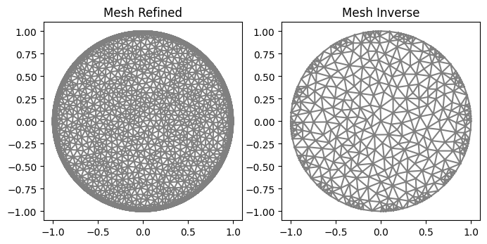
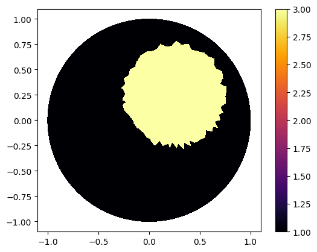
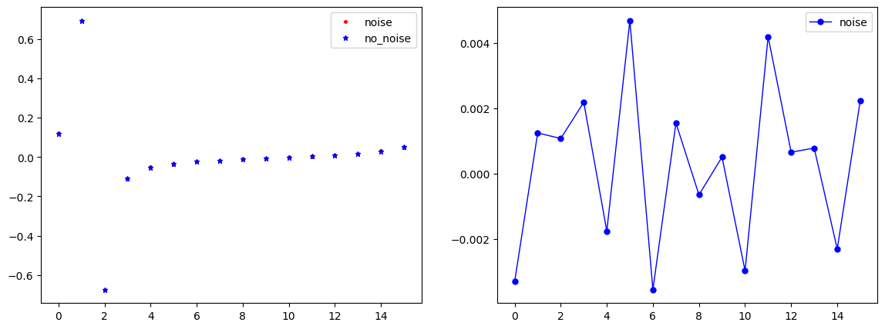
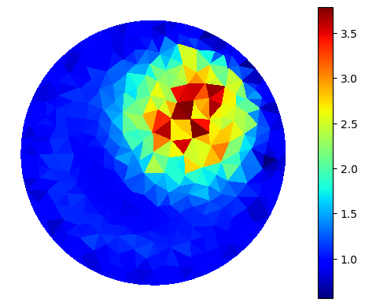
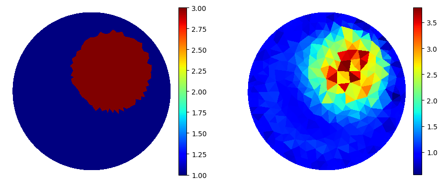
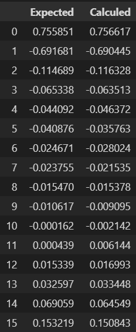
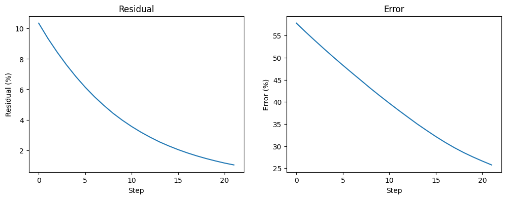
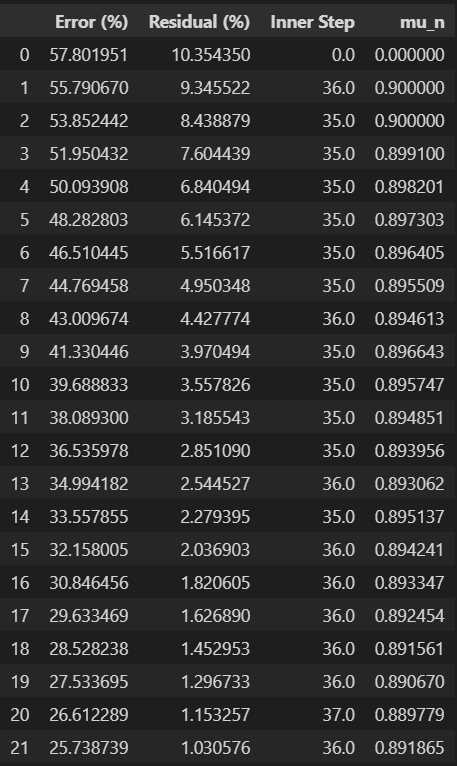

.. tutorial

Inverse Problem
=========================================

This demo is implemented in a single Python file. Download here: :download:`tutorial_inverse.ipynb`

This demo illustrates how to:

* How to use :class:`InverseProblem`.::

    from EIT_CEM_app import *
    %matplotlib inline

Mesh
**********************

::

    "Electrodes and Mesh"
    ele_pos=electrodes_position(L=16, per_cober=0.5, rotate=0)
    mesh_refined=MyMesh(r=1, n=20, n_in=80, n_out=60, electrodes_obj=ele_pos)
    mesh_inverse=MyMesh(r=1, n=10, n_in=8, n_out=1, electrodes_obj=ele_pos)
    
::
    
    plt.figure(figsize=(8, 8))
    plt.subplot(1,2,1)
    plot(mesh_refined, title="Mesh Refined");
    plt.subplot(1,2,2)
    plot(mesh_inverse, title="Mesh Inverse");

Defining Gamma function
****************************************

::

    ValuesCells0=GammaCircle(mesh_refined,3.0,1.0,0.50, 0.25, 0.25);
    Q = FunctionSpace(mesh_refined, "DG", 0) #Define Function space with basis Descontinuous Galerkin
    gamma0 = Function(Q)
    gamma0.vector()[:]=ValuesCells0          

    "Plot"
    plot_figure(gamma0, name="")
    

Forward Problem
****************************************

::

    "Forward Problem"
    VD=FiniteElement('CG',mesh_refined.ufl_cell(),1) #Lagrange pol. degree 1
    L=16                                            #Electrodes number
    l=15                                             #Measurements number.
    z=np.ones(L)*0.025                              #Impedance
    I_all=current_method(L,l, method=2, value=1)    #Current pattern

    #Solver
    ForwardObject=ForwardProblem(mesh_refined, z)
    list_u0, list_U0 = ForwardObject.solve_forward(VD, I_all, gamma0)
    list_U0 = ForwardObject.sol_asarray()

Solver
****************************************

Noise plot
----------------------
::

    "Getting noised solution"
    noise_level=0.01 #0.5%
    noise_type='uniform'
    if noise_level>1E-10: list_U0_noised = ForwardObject.add_noise(noise_level, noise_type, seed=1)
    
::

    "Plot electrodes noise."
    index=1 #Index in array

    if noise_level>1E-5:
        vec_U0_noise=list_U0_noised[index*L:(index+1)*L]
        vec_U0=list_U0[index*L:(index+1)*L]
        x=range(len(vec_U0_noise))

        plt.figure(figsize=(14, 5),)
        plt.subplot(1,2,1)
        plt.plot(x, vec_U0_noise, linewidth=0,  marker='.', markersize=5, label="noise", color='red');
        plt.plot(x, vec_U0, linewidth=0,  marker='*', markersize=5, label="no_noise", color="blue");
        plt.legend()

        plt.subplot(1,2,2)
        plt.plot(x, vec_U0-vec_U0_noise, linewidth=1,  marker='.', markersize=10, label="noise", color="blue");
        plt.legend()

        plt.show()

Inverse Object and Parameters
---------------------------------

::

    "Object"
    InverseObject=InverseProblem(mesh_inverse, list_U0_noised, I_all, z, select_pot_method=0)

    "Solver Parameters"
    InverseObject.set_solverconfig(step_limit=100, verbose=True)
    InverseObject.set_NewtonParameters(mu_i=0.90, mumax=0.999, nu=0.99, R=1)
    #InverseObject.set_InnerParameters(inner_method='Landweber', land_a=20)
    InverseObject.set_InnerParameters(inner_method='ME', ME_reg=1E-4)
    #InverseObject.set_InnerParameters(inner_method='CG')
    #InverseObject.set_InnerParameters(inner_method='LM', LM_c0=0.95, LM_q=0.5)
    #InverseObject.set_InnerParameters(inner_method='Tikhonov', Tik_c0=0.95, Tik_q=0.1)

    #First step
    MyCellsgamma_k=np.ones(mesh_inverse.num_cells())*1.0
    InverseObject.set_firstguess(MyCellsgamma_k)

    "Noise Parameters"
    tau=1.15
    InverseObject.set_NoiseParameters(tau=tau, noise_level=noise_level)
    print(f"Discrepance stop {tau*noise_level*100}% residual")

    "Noise Parameters"
    InverseObject.set_answer(gamma0, mesh_refined)
    InverseObject.weight_value=True

::

    #Solver
    InverseObject.solve_inverse()

Getting Results
********************************

::

    "Getting the result"
    gamma_k=InverseObject.gamma_k
    list_U=InverseObject.list_U

    "Getting data_summary"
    innerstep_vec=InverseObject.innerstep_vec
    res_vec=InverseObject.res_vec
    mun_vec=InverseObject.mun_vec
    error_vec=InverseObject.error_vec

::

    #Plot 2D
    #Preparing Function
    Q_DG=FunctionSpace(mesh_inverse, "DG", 0)
    gamma_cell = Function(Q_DG)
    gamma_cell.vector()[:]=gamma_k.vector()[:]          #Transform vector to function

    #Plotting
    plot_figure(gamma_cell, name="", map="jet");
    plt.xticks([])
    plt.yticks([])
    plt.box(False)

   
   
Fancy plot
---------------------

::

    "Fancy plot"
    cmap='jet'
    fig=plt.figure(figsize=(9, 9))
    plt.subplot(1,2,1);
    p=plot(gamma0);
    p.set_cmap(cmap)
    plt.colorbar(p,fraction=0.046, pad=0.0);
    plt.xticks([])
    plt.yticks([])
    plt.box(False)

    plt.subplot(1,2,2);
    p=plot(gamma_k);
    p.set_cmap(cmap);
    plt.colorbar(p,fraction=0.046, pad=0.0);
    fig.tight_layout()
    plt.xticks([])
    plt.yticks([])
    plt.box(False)
    

    
    

Potencial in first measurement.
----------------------------------
::

    "Checking results"
    import pandas as pd #To print dataframe
    vec_U_plot=np.vstack((list_U0_noised, list_U))
    data=pd.DataFrame(vec_U_plot[:,0:16].T)
    experiments=["Expected", "Calculed"]
    data.columns = experiments
    data

Plot error and residual
--------------------------------
::

    plt.figure(figsize=(12, 4));
    "Residual Plot"
    plt.subplot(1,2,1)
    plt.ylabel('Residual (%)');
    plt.xlabel('Step');
    plt.title('Residual');
    plt.plot(range(0,len(res_vec)), res_vec);

    "Error plot"
    plt.subplot(1,2,2)
    plt.ylabel('Error(gamma_k - gamma_exact) (%)');
    plt.xlabel('Step');
    plt.title('Error');
    plt.plot(range(0,len(error_vec)), error_vec);

Summary data
---------------------
::

    summary_data=np.vstack((error_vec, res_vec, innerstep_vec, mun_vec))
    data=pd.DataFrame(summary_data.T)
    experiments=["Error (%)", "Residual (%) ", "Inner Step", "mu_n"]
    data.columns = experiments
    data

