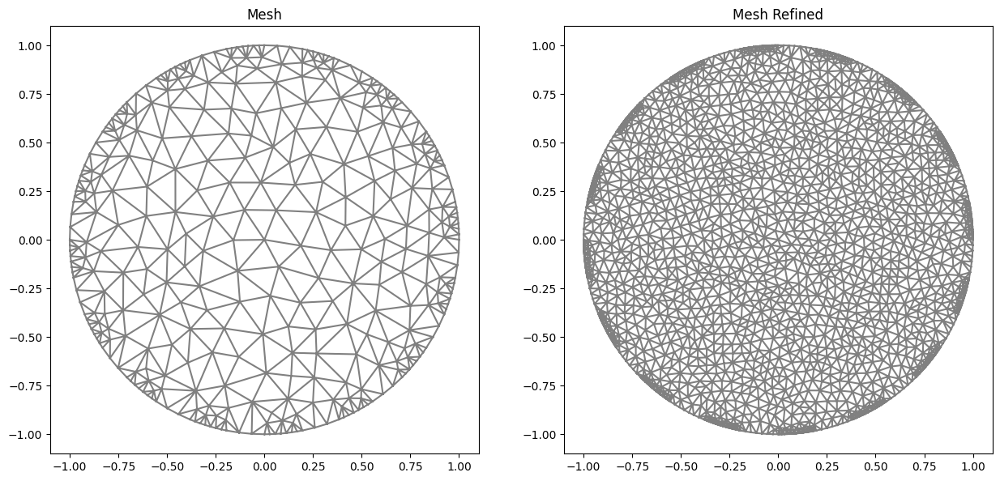
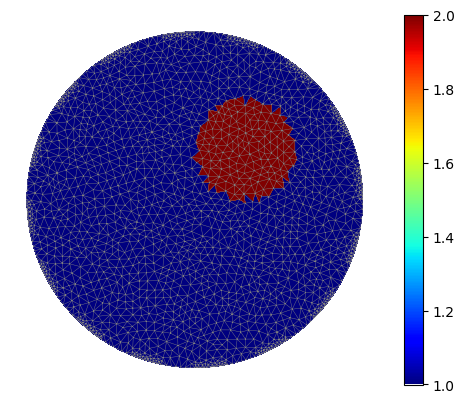
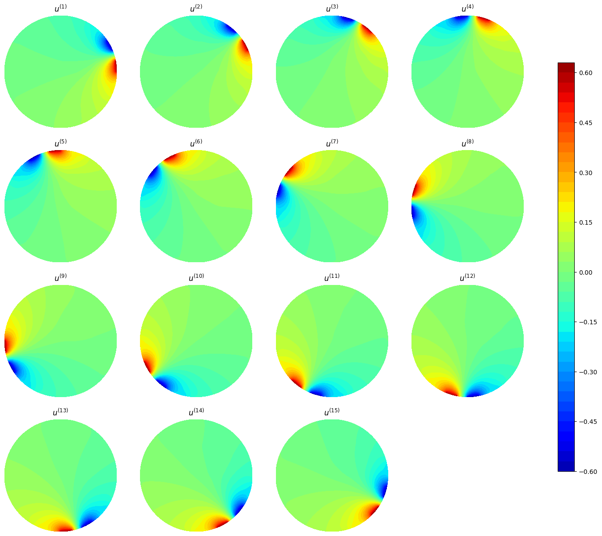
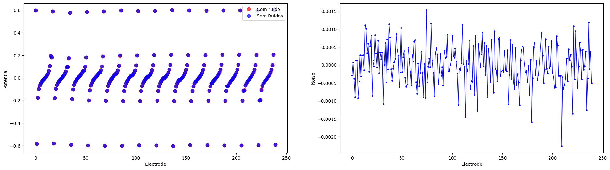

.. tutorial

Quick-Start
=========================================

This demo is implemented in a single Python file. Download it here: :download:`tutorial_quickstart.ipynb`

This demo illustrates how to:

* Create a mesh based on electrodes.
* Define functions within cells.
* Define a list of currents used in the experiment.
* Generate simulated data.
* Solve the Inverse Problem.

Importing
***************

::

    from module1_mesh import*
    from module2_forward import*
    from module3_inverse import*
    from module4_auxiliar import*
    import matplotlib.pyplot as plt
    %matplotlib inline

Electrodes
***************

The initial step for the complete electrode model (CEM) is to define the electrode region. For this purpose, we have the function
:func:`electrodes_position` to assist in the process. It is expected that the domain is a circle, for which the radius
needs to be known. Additionally, it asks for the number of electrodes (L) and the percentage area (per_cober) they
occupy. Then, the electrodes will be evenly distributed along the boundary. It is also possible to rotate the solution
using the 'rotate' argument.
::

    "Basic Definitions"
    r=1            #Circle radius
    L=16           #Number of Electrodes
    per_cober=0.5  #Percentage of area covered by electrodes
    rotate=0       #Rotation

    #Return object with angular position of each electrode
    ele_pos=electrodes_position(L, per_cober, rotate)

Mesh
***************

The second important step is to define the mesh to be used for generate the simulated data and the inverse problems. 
This mesh is built based on the electrodes. The mesh refinement (refine_n), the number of vertices on the electrodes (n_in),
and the number of vertices in the gaps (n_out) are specified.
::

    refine_n=8 #Refinement mesh
    n_in=8     #Vertex on elec.
    n_out=2    #Vertex on gaps (Sometimes it is important.)

    #Generating Mesh
    mesh=MyMesh(r=r, n=refine_n, n_in=n_in, n_out=n_out, electrodes_obj=ele_pos)
    mesh_refined=MyMesh(r=r, n=refine_n*3, n_in=n_in*3, n_out=n_out*3, electrodes_obj=ele_pos)

Gamma Function
***************

The third step involves defining an electrical conductivity function based on the elements of the mesh. 
For this purpose, the function :func:`GammaCircle` is used to create a circle displaced from the origin with a radius of 0.3,
where the conductivity inside the circle is 2.0, and outside it is 1.0. The previously mentioned function merely creates 
a vector where each entry represents the value of the cell in an element. The function is responsible for transforming
this vector into an Expression, which is used as a function in FENICS to solve the variational system.
In other words, we convert a vector into a function. 
::

    #Defining the function gamma in Descontinuous Galerkin
    ValuesCells0=GammaCircle(mesh_refined,2,1.0,0.3, 0.3, 0.3); #mesh, cond_in, cond_out, radius, certerx, cernteryValuesCells0=GammaCircle(mesh_forward,3.0,1.0,0.50, 0.25, 0.25); #mesh, cond_in, cond_out, radius, certerx, cerntery

Next, we show the solution in the DG (Discontinuous Galerkin) space.
::

    Q = FunctionSpace(mesh_refined, "DG", 0) #Define Function space with basis Descontinuous Galerkin
    gamma = Function(Q)
    gamma.vector()[:]=ValuesCells0
    "Plot"
    plot_figure(gamma, name="", map="jet");
    plot(mesh_refined, linewidth=0.3)
    plt.xticks([])
    plt.yticks([])
    plt.box(False)

Generating simulated data
******************************

Given the previous definitions, it is now possible to proceed with the data generation.
We simply need to define the function space used, where we use first-order Lagrange polynomials (CG - Continuous Galerkin),
the number of experiments (l), the impedance of the electrodes (z), and the currents used (I_all).
::

    #Defining impedances, experiments and currents
    z=np.ones(L)*2.5E-5     #Impedance of each electrode
    l=L-1                   #Numero of experiments
    I_all=current_method( L , l, method=2)  #Current
    VD=FiniteElement('CG',mesh_forward.ufl_cell(),1) #Solution Space Continous Galerkin

The function :func:`current_method` returns an array of arrays containing the values of currents in the electrodes.
There are other types of currents available, which can be checked in the documentation. If you want to use
a different type of current for the experiment, you just need to follow the same format when providing the currents.
If it's a single experiment, you only need to provide a simple array.
::

    print(np.array(I_all))

     [[ 1. -1.  0.  0.  0.  0.  0.  0.  0.  0.  0.  0.  0.  0.  0.  0.]
      [ 0.  1. -1.  0.  0.  0.  0.  0.  0.  0.  0.  0.  0.  0.  0.  0.]
      [ 0.  0.  1. -1.  0.  0.  0.  0.  0.  0.  0.  0.  0.  0.  0.  0.]
      [ 0.  0.  0.  1. -1.  0.  0.  0.  0.  0.  0.  0.  0.  0.  0.  0.]
      [ 0.  0.  0.  0.  1. -1.  0.  0.  0.  0.  0.  0.  0.  0.  0.  0.]
      [ 0.  0.  0.  0.  0.  1. -1.  0.  0.  0.  0.  0.  0.  0.  0.  0.]
      [ 0.  0.  0.  0.  0.  0.  1. -1.  0.  0.  0.  0.  0.  0.  0.  0.]
      [ 0.  0.  0.  0.  0.  0.  0.  1. -1.  0.  0.  0.  0.  0.  0.  0.]
      [ 0.  0.  0.  0.  0.  0.  0.  0.  1. -1.  0.  0.  0.  0.  0.  0.]
      [ 0.  0.  0.  0.  0.  0.  0.  0.  0.  1. -1.  0.  0.  0.  0.  0.]
      [ 0.  0.  0.  0.  0.  0.  0.  0.  0.  0.  1. -1.  0.  0.  0.  0.]
      [ 0.  0.  0.  0.  0.  0.  0.  0.  0.  0.  0.  1. -1.  0.  0.  0.]
      [ 0.  0.  0.  0.  0.  0.  0.  0.  0.  0.  0.  0.  1. -1.  0.  0.]
      [ 0.  0.  0.  0.  0.  0.  0.  0.  0.  0.  0.  0.  0.  1. -1.  0.]
      [ 0.  0.  0.  0.  0.  0.  0.  0.  0.  0.  0.  0.  0.  0.  1. -1.]]

With the basic definitions of the direct problem in place, it is now possible to solve it.
We create the object of the direct problem using the class :class:`ForwardProblem`, providing information such as the mesh,
electrode positions, and impedances. After that, we use the function .solver_forward() to solve the problem, using the function
space (VD), the conductivity function (gamma0), the electric currents (I_all) as arguments.
::

    ForwardObject=ForwardProblem(mesh_refined, z)

    VD=FiniteElement('CG',mesh_refined.ufl_cell(),1) #Solution Space Continous Galerkin
    list_u,list_U0 = ForwardObject.solve_forward(VD, I_all, gamma)
    list_U0 = (np.array(list_U0).flatten())

The solutions in the domain can be plotted using the following commands
::
    
    plt.figure(figsize=(10, 10))
    for i in range(0, l):
        plt.subplot(4,4,i+1)
        plot(list_u0[i])

The values of the potentials at the electrodes are contained in the vector list_U0.
::

    print(list_U0[0:L])
    [ 0.59683392 -0.58225101 -0.1770248  -0.09720831 -0.06548889 -0.04681257
    -0.03301847 -0.02162958 -0.01117799 -0.00067388  0.01052077  0.02352289
    0.04025457  0.06430932  0.10463569  0.19520837]
 
The noise in the data can be introduced using the following routines.
::

    #Noise add
    noise_level=0.25/100
    noise_type='uniform'
    list_U0_noised=fn_addnoise(list_U0, noise_level, noise_type, seed=42)
    

     

The inverse problem is straightforward to solve when you already have the mesh, impedances, and currents.
You simply need to provide a vector containing the values at the electrodes (list_U0) to the object :class:`InverseProblem`
and then call the function solve_inverse.::

    "Object"
    InverseObject=InverseProblem(mesh, list_U0_noised, I_all, z)

    "Solver Parameters"
    InverseObject.set_InnerParameters(inner_method='Landweber', land_a=20)
    InverseObject.set_solverconfig(step_limit=100, verbose=True)

    "First step"
    gamma_background=np.ones(mesh.num_cells())
    InverseObject.set_firstguess(gamma_background)

    "Noise Parameters"
    tau=1.05
    InverseObject.set_NoiseParameters(tau, noise_level)
    print(f"Discrepance stop {np.round(tau*noise_level*100,5)}% residue")

    "Extra data"
    InverseObject.set_answer(gamma, mesh_refined)

    #Solver
    InverseObject.solve_inverse()

    
The result can be extracted using .gamma_k on the object. Below is the plot of the solution.
::

    #Plot 2D
    #Preparing Function
    gamma_k=np.copy(InverseObject.gamma_all)[-1]    
    Q_DG=FunctionSpace(mesh, "DG", 0)
    gamma_cell = Function(Q_DG)
    gamma_cell.vector()[:]=gamma_k          #Transform vector to function

    #Plotting
    plot_figure(gamma_cell, name="", map="jet");
    plt.xticks([])
    plt.yticks([])
    plt.box(False)

.. image:: quick/gamma_ans.png
   :align: center
   :scale: 50 %

