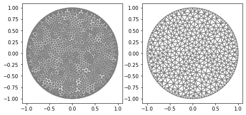
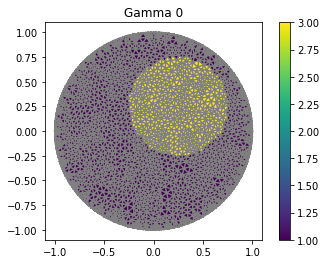
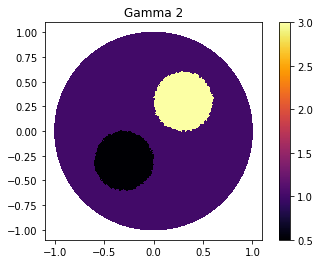
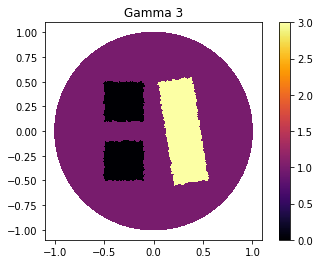
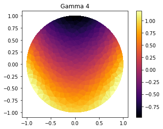
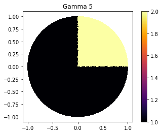

.. tutorial

Creating Functions
=========================================

This demo is implemented in a single Python file.

This demo illustrates how to:

* How to use :func:`GammaCircle`.
* Defines its function based on the cells.
* How to use Expression and Conditional Expression.

::

    from module1_mesh import*
    from module2_forward import*
    from module3_inverse import*
    from module4_auxiliar import*
    import matplotlib.pyplot as plt

**********************
Defining Mesh
**********************

::

    mesh_inverse, mesh_direct=MyMesh(r=1, n=12, n_vertex=121) #Genereting mesh

GammaCircle and plot_figure
****************************************

::

    ValuesCells0=GammaCircle(mesh_direct,3.0,1.0,0.50, 0.25, 0.25);

    "Plot"
    V_DG=FiniteElement('DG',mesh_direct.ufl_cell(),0)
    Q=FunctionSpace(mesh_direct,V_DG)
    gamma0_func=interpolate(gamma0, Q)
    p=plot(gamma0_func, title="Gamma 0")
    plot(mesh_direct)
    plt.colorbar(p)

    "Plot"
    V_DG=FiniteElement('DG',mesh_direct.ufl_cell(),0)
    plot_figure(mesh_direct, V_DG, gamma0, name="Gamma 0", map="viridis");

Combining Two Circles
****************************************

::

    ValuesCells0=GammaCircle(mesh_direct,2.5,0.5,0.30, 0.30, 0.30);
    ValuesCells1=GammaCircle(mesh_direct,0.0,0.5,0.30, -0.30, -0.30);     

    plot_figure(mesh_direct, V_DG, gamma1, name="Gamma 1", map="inferno");

Refining the Mesh for Best Results
****************************************

::

    mesh_direct2=refine(refine(mesh_direct))

    ValuesCells0=GammaCircle(mesh_direct2,2.5,0.5,0.30, 0.30, 0.30);
    ValuesCells1=GammaCircle(mesh_direct2,0.0,0.5,0.30, -0.30, -0.30);

    V_DG=FiniteElement('DG',mesh_direct2.ufl_cell(),0)
    plot_figure(mesh_direct2, V_DG, gamma2, name="Gamma 2", map="inferno");

GammaQuad
****************************************

::

    def GammaQuad(mesh, in_v, out_v, radius,centerx, centery, angle=0, a=1, b=1):
        ValuesGamma=np.zeros(mesh.num_cells())
        centerx_new = centerx*cos(angle)-centery*sin(angle)
        centery_new = centery*cos(angle)+centerx*sin(angle)
        centerx, centery=centerx_new, centery_new

        for i in range(0, mesh.num_cells()):
            cell = Cell(mesh, i)

            vertices=np.array(cell.get_vertex_coordinates())
            x=(vertices[0]+vertices[2]+vertices[4])/3           
            y=(vertices[1]+vertices[3]+vertices[5])/3

            "rotation"
            x_new=x*cos(angle)-y*sin(angle)
            y_new=y*cos(angle)+x*sin(angle)
            x,y=x_new,y_new

            if (1/a*abs(x-centerx)>=radius) or 1/b*abs(y-centery)>=radius:
                ValuesGamma[i]=out_v
            else:
                ValuesGamma[i]=in_v

        return ValuesGamma

    ValuesCells1=GammaQuad(mesh_direct2, 3.0, 1.0, 0.35, 0.3, 0.0, pi/2*0.9, 1.5, 0.5);
    ValuesCells2=GammaQuad(mesh_direct2,-1.0, 0.0, 0.2, -0.30, -0.30);
    ValuesCells3=GammaQuad(mesh_direct2,-1.0, 0.0, 0.2, -0.30, 0.30);       

    V_DG=FiniteElement('DG',mesh_direct2.ufl_cell(),0)
    plot_figure(mesh_direct2, V_DG, gamma3, name="Gamma 3", map="inferno");

   
   
Creating Functions Using Expression.
****************************************

::

    func=Expression("pow(x[0],2)-x[1]", degree=2)

    mesh=mesh_inverse
    ValuesCells4=np.zeros(mesh.num_cells())
    for cell in cells(mesh):
        ValuesCells4[cell.index()]=func(cell.midpoint())
       

    V_DG=FiniteElement('DG',mesh.ufl_cell(),0)
    plot_figure(mesh, V_DG, gamma4, name="Gamma 4", map="inferno");

Conditional Expression.
****************************************

::

    func2=Expression("x[1]>= 0 & x[0]>=0 ? 2 : 1 ", degree=2)

    mesh=mesh_direct2
    ValuesCells5=np.zeros(mesh.num_cells())
    for cell in cells(mesh):
        ValuesCells5[cell.index()]=func2(cell.midpoint())    

    V_DG=FiniteElement('DG',mesh.ufl_cell(),0)
    plot_figure(mesh, V_DG, gamma5, name="Gamma 5", map="inferno");

