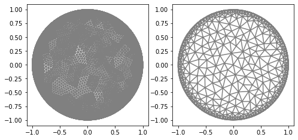
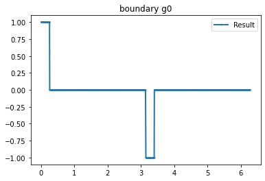
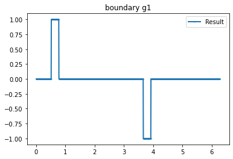
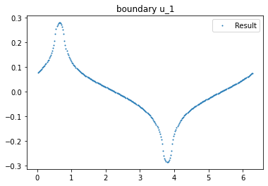
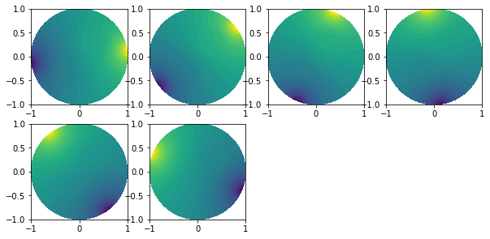
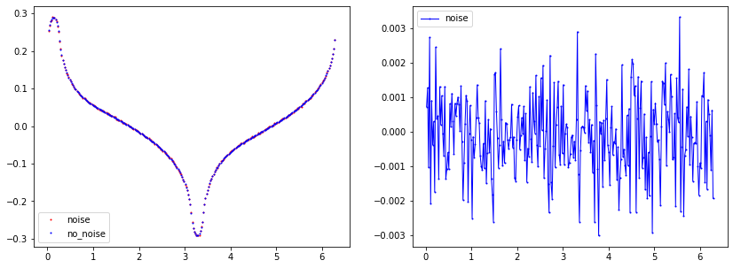

.. tutorial

Forward Problem
=========================================

This demo is implemented in a single Python file. Download here: :download:`tutorial_forward.ipynb`

This demo illustrates how to:

* How to use :class:`ForwardProblem`.::

    from module1_mesh import*
    from module2_forward import*
    from module3_inverse import*
    from module4_auxiliar import*
    import matplotlib.pyplot as plt

Mesh
**********************

::

    mesh_inverse, mesh_direct=MyMesh(r=1, n=8, n_vertex=281)
    mesh_direct=refine(mesh_direct)

Defining Current
****************************************

::

    "Current"
    n_g=6 #Number currents
    I_all=current_method(n_g, value=1, method=1) #Creating current

    #Plotting
    for i in range(n_g):
        if i<=1:
            mesh=mesh_direct
            VD=FiniteElement('CG',mesh.ufl_cell(),1) 
            g_u=interpolate(I_all[i], FunctionSpace(mesh,VD))
            g_u=getBoundaryVertex(mesh, g_u)
            bond=plot_boundary(mesh, data=g_u, name='boundary g'+str(i))

Verifing hypothesis
---------------------------

::

    >>> print("Mesh Direct:")
    >>> Verifyg(I_all, mesh_direct)
    >>> print("Mesh Inverse:")
    >>> Verifyg(I_all, mesh_inverse)
    
    Mesh Direct:
    Integral boundary: 2.480654570646834e-16 0
    Integral boundary: -2.0816681711721685e-17 1
    Integral boundary: 8.673617379884035e-18 2
    Integral boundary: 3.2439329000766293e-16 3
    Integral boundary: -2.393918396847994e-16 4
    Integral boundary: -1.3357370765021415e-16 5
    Integral boundary g(0)*g(1): 0.0
    Integral boundary g(0)*g(2): 0.0
    Integral boundary g(0)*g(3): 0.0
    Integral boundary g(0)*g(4): 0.0
    Integral boundary g(0)*g(5): 0.0
    Integral boundary g(1)*g(2): 0.0
    Integral boundary g(1)*g(3): 0.0
    Integral boundary g(1)*g(4): 0.0
    Integral boundary g(1)*g(5): 0.0
    Integral boundary g(2)*g(3): 0.0
    Integral boundary g(2)*g(4): 0.0
    Integral boundary g(2)*g(5): 0.0
    Integral boundary g(3)*g(4): 0.0
    Integral boundary g(3)*g(5): 0.0
    Integral boundary g(4)*g(5): 0.0
    Mesh Inverse:
    Integral boundary: 1.8041124150158794e-16 0
    Integral boundary: 6.938893903907228e-18 1
    Integral boundary: 3.469446951953614e-17 2
    Integral boundary: 4.510281037539698e-16 3
    Integral boundary: -4.163336342344337e-16 4
    Integral boundary: -4.85722573273506e-17 5
    Integral boundary g(0)*g(1): 0.0
    Integral boundary g(0)*g(2): 0.0
    Integral boundary g(0)*g(3): 0.0
    Integral boundary g(0)*g(4): 0.0
    Integral boundary g(0)*g(5): 0.0
    Integral boundary g(1)*g(2): 0.0
    Integral boundary g(1)*g(3): 0.0
    Integral boundary g(1)*g(4): 0.0
    Integral boundary g(1)*g(5): 0.0
    Integral boundary g(2)*g(3): 0.0
    Integral boundary g(2)*g(4): 0.0
    Integral boundary g(2)*g(5): 0.0
    Integral boundary g(3)*g(4): 0.0
    Integral boundary g(3)*g(5): 0.0
    Integral boundary g(4)*g(5): 0.0

Defining Gamma function
****************************************

::

    "Defining gamma"
    ValuesCells0=GammaCircle(mesh_direct,3,1,0.25, 0.30, 0.30); #malha, cond_interna, cond_externa, raio.
    ValuesCells1=GammaCircle(mesh_direct,1, 0,0.25, -0.30, -0.30); #malha, cond_interna, cond_externa, raio.

    "Plot"
    V_DG=FiniteElement('DG',mesh_inverse.ufl_cell(),0)
    gamma_direct=plot_figure(mesh_direct, V_DG, gamma0, name="Gamma");    

.. image:: forward/gamma.png
   :scale: 75 %

Forward Problem
****************************************

::

    "ForwardProblem"
    VD=FiniteElement('CG',mesh_direct.ufl_cell(),1)       #Defining space
    ForwardObject=ForwardProblem(mesh_direct)               #Defining object
    list_u0=ForwardObject.solve_forward(VD, gamma0, I_all)  #Solver
    u0_boundary=ForwardObject.boundary_array(mesh_inverse) #Boundary data

Boundary plot
----------------------
::

   data_u0=ForwardObject.plot_boundary(mesh_inverse, index=1)

Plot solution
----------------

::

    plt.figure(figsize=(10, 10))
    for i in range(0, n_g):
        plt.subplot(4,4,i+1)
        plot(list_u0[i])
              

   
Noise
----------------

::

    "Noise Parameters"
    noise_level=0.01
    noise_type='uniform'
    seed=1
    u0_boundary=ForwardObject.add_noise(noise_level, noise_type, seed, mesh_inverse)

::

    "Noise Parameters"
    noise_level=0.01
    noise_type='uniform'
    seed=1
    u0_boundary=ForwardObject.add_noise(noise_level, noise_type, seed, mesh_inverse)
    end=len(u0_boundary)

    index=0
    if noise_level>1E-5:
        u0_boundary_c=ForwardObject.boundary_array(mesh_inverse, concatenate=False) #Data without noise
        u_dados_noise=u0_boundary[0:int(end/n_g)] # First experiment
        data_u0=plot_boundary(mesh_inverse, data=u0_boundary_c[index], name='boundary u0_0', line=0, plot=False)
        data_u0_noise=plot_boundary(mesh_inverse, data=u_dados_noise, name='boundary u0_0', line=0, plot=False)

        plt.figure(figsize=(14, 5))
        plt.subplot(1,2,1)
        plt.plot(data_u0_noise[:,0], data_u0_noise[:,1], linewidth=0,  marker='.', markersize=2, label="noise", color='red');
        plt.plot(data_u0[:,0], data_u0[:,1], linewidth=0,  marker='.', markersize=2, label="no_noise", color="blue");
        plt.legend()

        plt.subplot(1,2,2)
        plt.plot(data_u0[:,0], data_u0[:,1]-data_u0_noise[:,1], linewidth=1,  marker='.', markersize=2, label="noise", color="blue");
        plt.legend()

        plt.show()
    
        

