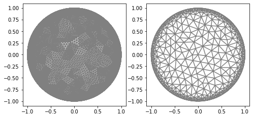
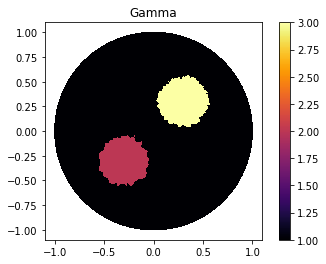
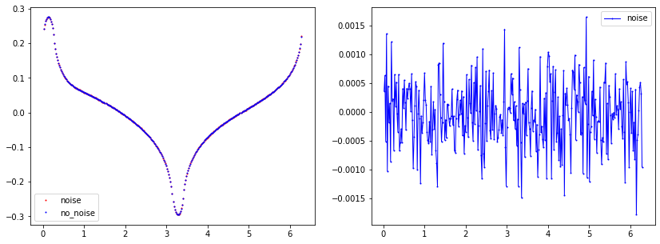
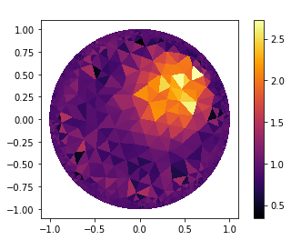
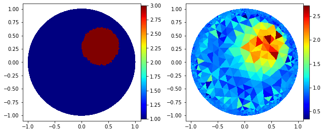
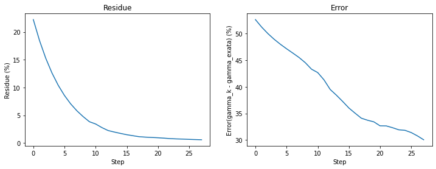
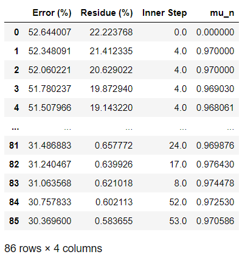

.. tutorial

Inverse Problem
=========================================

This demo is implemented in a single Python file. Download here: :download:`tutorial_inverse.ipynb`

This demo illustrates how to:

* How to use :class:`InverseProblem`.::

    from module1_mesh import*
    from module2_forward import*
    from module3_inverse import*
    from module4_auxiliar import*
    import matplotlib.pyplot as plt

Mesh
**********************

::

    mesh_inverse, mesh_direct=MyMesh(r=1, n=8, n_vertex=321)
    mesh_direct=refine(mesh_direct)
    
::
    
    plt.figure(figsize=(8, 8))
    plt.subplot(1,2,1)
    plot(mesh_direct);
    plt.subplot(1,2,2)
    plot(mesh_inverse);

   
Current
**************************

::

    "Current"
    n_g=6
    I_all=current_method(n_g, value=1, method=1)

    "Checking hyphotesis"
    Verifyg(I_all, mesh_direct)
    Verifyg(I_all, mesh_inverse)

Defining Gamma function
****************************************

::

  "Defining gamma"
    ValuesCells0=GammaCircle(mesh_direct,3,1,0.35, 0.35, 0.30); #malha, cond_interna, cond_externa, raio.

    "Plot"
    V_DG=FiniteElement('DG',mesh_inverse.ufl_cell(),0)
    gamma_direct=plot_figure(mesh_direct, V_DG, gamma0, name="Resposta gamma");

Forward Problem
****************************************

::

    "ForwardProblem"
    VD=FiniteElement('CG',mesh_direct.ufl_cell(),1) 
    ForwardObject=ForwardProblem(mesh_direct)
    list_u0=ForwardObject.solve_forward(VD, gamma0, I_all)

    u0_boundary=ForwardObject.boundary_array(mesh_inverse) #Boundary data in the mesh_inverse

Noise plot
----------------------

::

    "Noise Parameters"
    noise_level=0.005 #0.5%
    noise_type='uniform'
    seed=1
    u0_boundary=ForwardObject.add_noise(noise_level, noise_type, seed, mesh_inverse)

::

    end=len(u0_boundary)
    if noise_level>1E-5:
        u0_boundary_c=ForwardObject.boundary_array(mesh_inverse, concatenate=False)
        u_dados_noise=u0_boundary[0:int(end/n_g)]
        data_u0=plot_boundary(mesh_inverse, data=u0_boundary_c[index], name='boundary u0_0', line=0, plot=False)
        data_u0_noise=plot_boundary(mesh_inverse, data=u_dados_noise, name='boundary u0_0', line=0, plot=False)

        plt.figure(figsize=(14, 5))
        plt.subplot(1,2,1)
        plt.plot(data_u0_noise[:,0], data_u0_noise[:,1], linewidth=0,  marker='.', markersize=2, label="noise", color='red');
        plt.plot(data_u0[:,0], data_u0[:,1], linewidth=0,  marker='.', markersize=2, label="no_noise", color="blue");
        plt.legend()

        plt.subplot(1,2,2)
        plt.plot(data_u0[:,0], data_u0[:,1]-data_u0_noise[:,1], linewidth=1,  marker='.', markersize=2, label="noise", color="blue");
        plt.legend()

        plt.show()
    

   
   
Inverse Problem
******************************

Inverse Object and Parameters
---------------------------------

::

    "Object"
    VI=FiniteElement('CG',mesh_inverse.ufl_cell(),1) 
    InverseObject=InverseProblem(mesh_inverse, VI, u0_boundary, I_all)

    "Solver Parameters"
    InverseObject.set_solverconfig(step_limit=100)
    InverseObject.set_NewtonParameters(mu_i=0.97, mumax=0.999, nu=0.99, R=0.999)
    #InverseObject.set_InnerParameters(inner_method='Landweber', land_a=20)
    InverseObject.set_InnerParameters(inner_method='ME', ME_reg=5E-3)
    #InverseObject.set_InnerParameters(inner_method='CG')
    #InverseObject.set_InnerParameters(inner_method='LM', LM_c0=0.95, LM_q=0.05)
    #InverseObject.set_InnerParameters(inner_method='Tikhonov', Tik_c0=0.95, Tik_q=0.05)

    "Noise Parameters"
    tau=1.2
    InverseObject.set_NoiseParameters(tau=tau, noise_level=0.005)
    print(f"Discrepance stop {tau*noise_level*100}% residue")

    "Extra Parameters"
    InverseObject.set_answer(gamma0, mesh_direct)
    InverseObject.weight_value=False
    #MyCellsgamma_k=np.ones(mesh_inverse.num_cells())*2.0
    #InverseObject.set_firstguess(MyCellsgamma_k)

::

    Discrepance stop 0.6% residue

::

    #Solver
    InverseObject.solve_inverse()

Getting Results
********************************

::

    "Getting the result"
    gamma_k=InverseObject.gamma_k

    "Getting data_summary"
    innerstep_vec=InverseObject.innerstep_vec
    res_vec=InverseObject.res_vec
    mun_vec=InverseObject.mun_vec
    error_vec=InverseObject.error_vec

::

    "Plot result"
    V_DG=FiniteElement('DG',mesh_inverse.ufl_cell(),0)
    gamma_k=plot_figure(mesh_inverse, V_DG, gamma_k, name=" ");

   
   
Fancy plot
---------------------

::

    "Fancy plot"
    cmap='jet'
    #cmap='inferno'
   
    fig=plt.figure(figsize=(9, 9))
    plt.subplot(1,2,1);
    p=plot(gamma_direct);
    p.set_cmap(cmap)
    plt.colorbar(p,fraction=0.046, pad=0.0);

    plt.subplot(1,2,2);
    p=plot(gamma_k);
    p.set_cmap(cmap);
    plt.colorbar(p,fraction=0.046, pad=0.0);
    fig.tight_layout() 
    

    

Plot error and residue
--------------------------------

::

    plt.figure(figsize=(12, 4));

    "Subplot 1"
    plt.subplot(1,2,1)
    plt.ylabel('Residue (%)');
    plt.xlabel('Step');
    plt.title('Residue');
    plt.plot(range(0,len(res_vec)), res_vec);

    "Subplot 2"
    plt.subplot(1,2,2)
    plt.ylabel('Error(gamma_k - gamma_exata) (%)');
    plt.xlabel('Step');
    plt.title('Error');
    plt.plot(range(0,len(error_vec)), error_vec);

Summary data
---------------------
::

    summary_data=np.vstack((error_vec, res_vec, innerstep_vec, mun_vec))
    data=pd.DataFrame(summary_data.T)
    experiments=["Error (%)", "Residue (%) ", "Inner Step", "mu_n"]
    data.columns = experiments
    data

