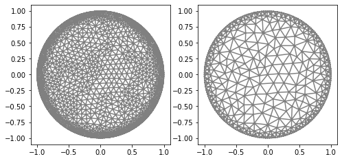
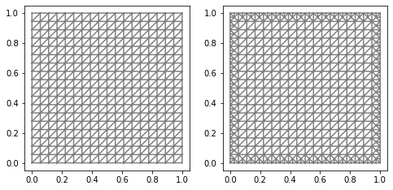
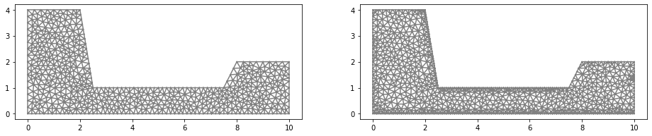

.. tutorial

Creating mesh
=========================================

This demo is implemented in a single Python file.

This demo illustrates how to:

* Create mesh.
* Use :func:`MyMesh`.

::

    #Auxiliar modules
    from module1_mesh import*
    from module2_forward import*
    from module3_inverse import*
    from module4_auxiliar import*
    import matplotlib.pyplot as plt

Defining mesh - circle
**********************

::

    mesh_inverse, mesh_direct=MyMesh(r=1, n=8, n_vertex=201)
    
::

    plt.figure(figsize=(8, 8))
    plt.subplot(1,2,1)
    plot(mesh_direct);
    plt.subplot(1,2,2)
    plot(mesh_inverse);

Defining mesh - square
**************************
::

    mesh_square = UnitSquareMesh(18, 18);
    
We can define a routine basead in SubDomain class to refine only the boundary of the mesh.::

    #Subdomain class to mark boundary
    class boundary(SubDomain):
        def inside(self, x, on_boundary):
            return on_boundary

    #Creating mark object.
    cell_mark_ref=MeshFunction("bool", mesh_square, mesh_square.topology().dim()-1)
    cell_mark_ref.set_all(False)
    boundary().mark(cell_mark_ref, True)

    #Refining boundary using cell_mark_ref.
    mesh_square_refined=refine(mesh_square, cell_mark_ref)

::

    plt.figure(figsize=(8, 8))
    plt.subplot(1,2,1)
    plot(mesh_square);
    plt.subplot(1,2,2)
    plot(mesh_square_refined);

   
Defining mesh - points
**************************
::

    # Create list of polygonal domain vertices
    domain_vertices = [Point(0.0, 0.0),
                       Point(10.0, 0.0),
                       Point(10.0, 2.0),
                       Point(8.0, 2.0),
                       Point(7.5, 1.0),
                       Point(2.5, 1.0),
                       Point(2.0, 4.0),
                       Point(0.0, 4.0),
                       Point(0.0, 0.0)]

    domain = Polygon(domain_vertices)

    n=30
    mesh_points = generate_mesh(domain,n)

::

    cell_mark_ref=MeshFunction("bool", mesh_points, mesh_points.topology().dim()-1)
    cell_mark_ref.set_all(False)
    boundary().mark(cell_mark_ref, True)

    mesh_points_refined=refine(mesh_points,cell_mark_ref)

::

    plt.figure(figsize=(16, 16))
    plt.subplot(1,2,1)
    plot(mesh_points);
    plt.subplot(1,2,2)
    plot(mesh_points_refined);
    mesh_points_refined=refine(mesh_points,cell_mark_ref)

Extra Tutorial
********************

https://fenicsproject.org/docs/dolfin/1.4.0/python/demo/documented/built-in_meshes/python/documentation.html

https://fenicsproject.org/docs/dolfin/1.4.0/python/demo/documented/mesh-generation/python/documentation.html