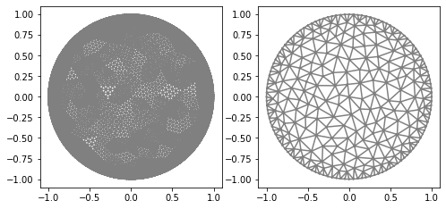
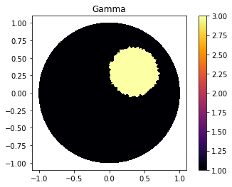
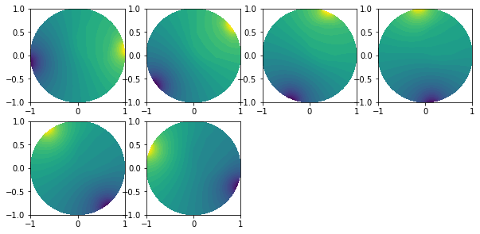
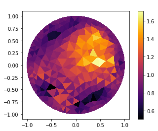

.. tutorial

Quick-Start
=========================================

This demo is implemented in a single Python file.

This demo illustrates how to:

* Create mesh based.
* Create functions defined in cells.
* Define a list of currents used in the experiment.
* Solve Forward Problem.
* Solve inverse Problem

Importing
***************

::

    from module1_mesh import*
    from module2_forward import*
    from module3_inverse import*
    from module4_auxiliar import*
    import matplotlib.pyplot as plt

Mesh
***************

::

    mesh_inverse, mesh_direct=MyMesh(r=1, n=8, n_vertex=121) #Genereting mesh
    mesh_direct=refine(mesh_direct)                          #Refine again mesh

::

    "Plot"
    plt.figure(figsize=(8, 8))
    plt.subplot(1,2,1)
    plot(mesh_direct);
    plt.subplot(1,2,2)
    plot(mesh_inverse);

Gamma Function
***************

::

    "Defining gamma"
    ValuesCells0=GammaCircle(mesh_direct,3,1,0.35, 0.35, 0.30); #mesh, value_int, value_ex, radius, certerx, certery.

    "Plot"
    V_DG=FiniteElement('DG',mesh_inverse.ufl_cell(),0) #Descontinous Galerkin degree 0
    gamma_direct=plot_figure(mesh_direct, V_DG, gamma0, name="Gamma"); #Just plot my gamma0

Forward Problem
***************

Eletric Current
---------------------

::
  
    "Current"
    n_g=6  #Number measurements 
    I_all=current_method(n_g, value=1, method=1) #Function that returns the current

Solver
-------------

::

    "ForwardProblem"
    VD=FiniteElement('CG',mesh_direct.ufl_cell(),1)      #Continuos Galerking degree 1
    ForwardObject=ForwardProblem(mesh_direct)              #Forward Object  
    list_u0=ForwardObject.solve_forward(VD, gamma0, I_all) #Solver, Space, gamma and current.

    #If you will use it in the inverse problem without noise.
    u0_boundary=ForwardObject.boundary_array(mesh_inverse) #Boundary data in the mesh_inverse

::

    plt.figure(figsize=(10, 10))
    for i in range(0, n_g):
        plt.subplot(4,4,i+1)
        plot(list_u0[i])

   

Noise
-------------

::

    #Setting noise in the data.
    "Noise Parameters"
    noise_level=0.005 #0.5%
    noise_type='uniform' 
    seed=1 #Random seed

    u0_boundary=ForwardObject.add_noise(noise_level, noise_type, seed, mesh_inverse) #Returns noised data.

Inverse Problem
***************
   
::

    "Object"
    VI=FiniteElement('CG',mesh_inverse.ufl_cell(),1)                   #Creating Object
    InverseObject=InverseProblem(mesh_inverse, VI, u0_boundary, I_all) #Add mesh, space, data, current
    InverseObject.set_NoiseParameters(tau=2, noise_level=0.005)        #Inform if data is noised
    InverseObject.set_solverconfig(step_limit=30)                      #Step Limit

    "Solver"
    InverseObject.solve_inverse() #Solve   

::

    "Getting the result"
    gamma_k=InverseObject.gamma_k

    "Plot result"
    V_DG=FiniteElement('DG',mesh_inverse.ufl_cell(),0)
    gamma_k=plot_figure(mesh_inverse, V_DG, gamma_k, name=" ");
    
